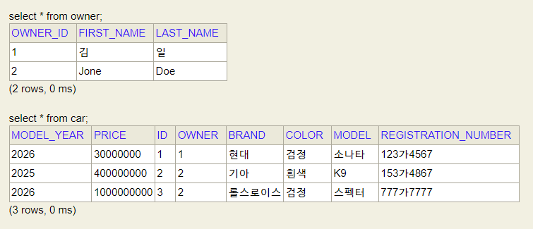

# 입실체크

# JPA를 이용한 DB 생성 및 접근
## JPA
1. 정의
JPA(Jakarta Persistence API)의 축약어로 엔티티 클래스를 통해 DB를 정의하는 방법.

즉, 저희가 HediSQL를 통해서 DB를 생성하고 TABLE 생성, COLUMN 정의, 그리고 SQL문을 활용하여 row들을 
추가 / 수정 / 삭제 / 조회를 했던 것과 달리 SpringBoot 프로젝트 내에서 해결을 한다는 점입니다.

## ORM
  - Object Relation Mapping : 객체 지향 프로그래밍 패러다임을 이용하여 DB를 가져오고 매핑할 수 있는 기술
                              (특정 JAVA 코드가 SQL문에 대응된다는 의미). DB 구조보다는 객체지향 개념을 바탕에
                              두고 있어 자바 프로그래머들에게 유용하고, 별개의 sql문을 숙달할 필요가 없기에
                              개발 속도 및 소스 코드의 양을 줄여줌, 그리고 대부분의 DB에 독립적이기에 DBMS에 따라
                              조금씩 달라지는 SQL문의 dialect에 대해 걱정할 필요가 없음 (이사가 쉽다)

## JPA(ORM 비교 상에서의)
  - 이전에는 JAVA Persistence API라고 불렸고, Java 개발자를 위한 ORM을 제공합니다.
    여기서 JPA Entity는 데이터베이스 테이블의 구조를 나타내는 Java 클래스를 의미합니다.
    즉, 클래스는 테이블 명, field 명은 column 명으로 대응되고, 거기서 생성되는 각 객체의
    field 값들의 조합이 row로 이루어진다고 볼 수 있음.

## 하이버네이트 (Hibernate)
  - 최근에는 가장 인기 있는 구현체이면서, SpringBoot 상에서의 기본 구현체로 사용
    기업 수준의 애플리케이션에서 자주 사용됨.

## Entity 클래스 만들기
  - JPA에서 `@Entity` 에너테이션을 이용하여 Java 클래스, 엔티티 클래스는 표준 자바 빈의 명명 규칙을 따르며,
    적절한 Getter / Setter를 가짐.

  - JPA는 애플리케이션이 초기화될 때 _클래스 이름으로 데이터베이스 테이블을 생성_ 합니다.
    그래서 데이터베이스 테이블에 다른 이름을 명명하고 싶다면 엔티티 클래스에 `@Table(name = "?")`를 지정
      - 여기서 중요한 점은 User 엔티티 클래스를 만들었을 때 얘가 테이블명이 되면
        예약어라서 오류가 나는 경우가 많아 `@Table(name = "user")`로 지정해주는 경우가 기본 템플릿

```java
@Entity
public class Car {
    @Id
    @GeneratedValue(strategy = GenerationType.AUTO)
    private Long id;
    
    private String brand, model, color, registrationNumber;
    
    private int modelYear, price;
}
```

- 엔티티 클래스는 데이터베이스에서 기본 키로 이용되는 고유한 ID를 포함해야 함.
  그런데 field 상에서 뭐가 기본 키인지 DB는 알 바가 아니기에 이를 명시하기 위해서
  `@Id`를 이용해서 정의함. `@GeneratedValue` 애너테이션은 데이터베이스가 자동으로
  ID를 생성하도록 지정 (즉, AUTO_INCREMENT를 의미합니다.) 다른 키 생성 전략을
  지정하는 것도 가능. AUTO 유형의 경우는 JPA가 특정 데이터베이스에 적합한 전략을
  택한다는 의미이며, default 생성 유형에 해당합니다.
  또한 `@Id` 애너테이션을 여러 속성을 추가하여 복합 기본 키를 만드는 것도 가능.

- 데이터베이스의 컬럼명은 기본적으로 클래스 필드 명명 규칙에 따라 지정됨.
  다른 명명 규칙을 사용하고 싶다면 `@Column` 에너테이션을 적용하면 됨.
  그리고 컬럼의 길이 및 컬럼의 nullable 여부를 지정하는 것도 가능함.
  예를 들어

```java
@Column(name = "explanation", nullable = false, length = 512)
private String description
```

- 그리고 저희가 Lombok을 쓰기에 AllArgsConstructor를 쓰면 좋을 것 같은데, id 필드가
  자동생성이기에 오히려 AllArgs를 적용하면 오류가 납니다.

```java
@Entity
public class Car {
    @Id
    @GeneratedValue(strategy = GenerationType.AUTO)
    private Long id;

    private String brand, model, color, registrationNumber;

    private int modelYear, price;

    public Car() {}

    public Car(String brand, String model, String color, String registrationNumber, int modelYear, int price) {
        this.brand = brand;
        this.model = model;
        this.color = color;
        this.registrationNumber = registrationNumber;
        this.modelYear = modelYear;
        this.price = price;
    }

    public String getBrand() {
        return brand;
    }

    public void setBrand(String brand) {
        this.brand = brand;
    }

    public String getModel() {
        return model;
    }

    public void setModel(String model) {
        this.model = model;
    }

    public String getColor() {
        return color;
    }

    public void setColor(String color) {
        this.color = color;
    }

    public String getRegistrationNumber() {
        return registrationNumber;
    }

    public void setRegistrationNumber(String registrationNumber) {
        this.registrationNumber = registrationNumber;
    }

    public int getModelYear() {
        return modelYear;
    }

    public void setModelYear(int modelYear) {
        this.modelYear = modelYear;
    }

    public int getPrice() {
        return price;
    }

    public void setPrice(int price) {
        this.price = price;
    }
```
이하는 롬복 Car를 적용한 버전
```java
@Entity
// Lombok을 의존성 주입하고, Car 클래스를 롬복 적용 버전으로 다 수정하시오,.
// 이후 동일하게 동일하게 localhost:8080/h2-console 을 통해 접속해 성공하시오.
@Getter
@Setter
public class Car {
    @Id
    @GeneratedValue(strategy = GenerationType.AUTO)
    private Long id;

    private String brand, model, color, registrationNumber;

    private int modelYear, price;

    public Car() {}

    public Car(String brand, String model, String color, String registrationNumber, int modelYear, int price) {
        this.brand = brand;
        this.model = model;
        this.color = color;
        this.registrationNumber = registrationNumber;
        this.modelYear = modelYear;
        this.price = price;
    }
}
```

## CRUD repsitory 만들기
  - Spring Data JPA에는 CRUD 작업을 위한 `CrudRepository`가 존재함.
    이를 통해 저희는 CarRepository 만들고 extends 받음.

  - 그렇다면 CarRepository는 CrudRepository를 상속 받았기에 거기 내부에 있는
    내부에 있는 추상 메서드들은 전부 다 사용할 수 있다는 의미.

  - 그런데 repository.save() 메서드를 고려했을 때, 내부의 argument로 Car 객체가 
    들어올거라고 예상할 수 없음. 이 부분을 제어하는 것이 Generic을 이용한
    `<Car, Long>` 부분

```java
package com.korit12.cardatabase.domain;

import org.springframework.data.repository.CrudRepository;

public interface CarRepository extends CrudRepository<Car, Long> {
}
```
이는 CarRepository가 테이블 역할을 하는 엔티티 클래스인 Car의 리포지토리 역할을 하는 인터페이스이며, 
id의 자료형이 Long임을 명시

- CRUD 관련 메서드 (즉, HediSQL 상에서는 쿼리문 작성 영역)들을 모아둔 것.

### 대표적인 CRUD 관련 메서드
1. long Count() - 엔티티의 수를 반환
2. IIterable<T> findAll() - 지정한 타입의 모든 항목을 반환 - select * 처럼 보임
3. Optional<T> findById(ID id) - 지정한 ID의 한 항목을 반환 - select * from car where id = ? 와 같은 역할
: optional 자료형이니까 없을 수도 있음
4. void delete(T entity) - 특정 엔티티 삭제 = delete from car where id = ?;
5. void deleteAll() - 리포지토리 내의 모든 엔티티 삭제
6. `<S extends T> save <S entity>` - 엔티티를 저장
7. List<S> saveAll(Iterable<S> entities) - 여러 엔티티들을 한 번에 저장

- 이상의 메서드 중 하나의 항목만을 return할 떄는 T 대신에 Optional<T>를 반환합니다.
Optional 클래스는 Java 8 SE에 도입된 자료형으로 값을 포함하거나 포함하지 않는 단일 값 컨테이너.
값이 존재하면 isPresenet() 메서드가 true를 return, 없으면 false를 return함.
그런데 어쨋든 자료형이 Optional이기에 if Present() {참조자료형캐스팅(from Optional to Car)} 과정이 요구됨.
그러면 get() 메서드를 통해 존재하는 Car 클래스의 객체를 추출할 수 있음.
이는 NullPointerException을 방지하기 위한 방법.

### 더미 데이터 추가 과정
- H2 인메모리에 더미데이터를 추가함. 실행될 때 마다 초기화되는 특성상 매번 H2인 메모리 DB에 INSERT를 하는 것은 번거롭기에 main 단계에
  더미 데이터들을 일괄 추가함.
  그러면 실행할 때마다 데이터 3개는 들어있게 될 것.

- 이상을 위해 CommandLineRunner 인터페이스를 구현함.
  인터페이스 구현했으니 빨간줄 뜸. 왜? 추상 메서드 구현해야 하기에..

- 그래서 CarRepository 내에 더미 데이터들을 잡아넣도록 하기 위해 field 선언을 통해 CarRepository respository;를 집어넣었고,
  얘가 포함된 생성자도 만들어 줌, 그래야 main 단계에서 CarRepository의 메서드인 .save()를 사용할 수 있기에....

```java
// field 선언
	private final CarRepository repository;

	@Override
	public void run(String... args) throws Exception {
		repository.save(new Car
				("현대", "소나타", "검정", "123가4567", 2026, 300000000)
		);
		repository.save(new Car
				("기아", "K9", "흰색", "153가4867", 2025, 400000000)
		);
		repository.save(new Car
				("롤스로이스", "스펙터", "검정", "777가7777", 2026, 1000000000)
		);
	}
}
```

### CRUD
```java
package com.korit12.cardatabase.domain;

import org.springframework.data.jpa.repository.JpaRepository;
import org.springframework.data.jpa.repository.Query;
import org.springframework.data.repository.CrudRepository;
import org.springframework.data.repository.PagingAndSortingRepository;

import java.util.List;

public interface CarRepository extends JpaRepository<Car, Long> {

    // CrudRepository에 없는 메서드라면 여기에 정의해줘야 함.
    // 쿼리는 접두사로 시작해야하고, 쿼리에 이용할 엔티티 클래스 필드를 정의해야 함.

    List<Car> findByBrand(String brand);

    // 색상으로 검정색, 그리고 연도를 검색하는 메서드를 직접 정의하시오.
    List<Car> findByColor(String color);
    List<Car> findByModelYear(int modelYear);

    // SQL 상에서의 AND 및 OR 연산자도 적용이 됨.
    // 브랜드와 모델로 자동차 검색
    List<Car> findByBrandAndModel(String brand, String model);

    // 브랜드 또는 색상 별로 자동차 가져오기 작성하시오.
    List<Car> findByBrandOrColor(String brand, String color);

    // 정렬도 집어넣을 수 있음 - 브랜드로 자동차 검색하고, 연도로 정렬
    List<Car> findByBrandOrderByModelYearAsc(String brand);

    // @Query 애너테이션을 이용해서 SQL문 자체를 집어넣을 수 있음.
    // 모델명으로 검색
    @Query("select c from Car c where c.model = ?1")
    List<Car> findByModel(String model);
    // 그런데 이상의 경우에는 일치하는 것만 구할 수가 있는데, @Query를 쓰는 이유는 LIKE
    // 연산자가 사용가능하기에....

    @Query("select c from Car c where c.brand like %?1")
    List<Car> findByBrandEndWith(String brand);

    // 다만 @Query를 쓰게 되면 다른 데이터베이스로의 이식성이 좀 떨어지긴 함.
}
```
CrudRepository부터 확장된 PagingAndSortingRepository도 있음.
얘는 페이징 및 정렬을 통해 엔티티 클래스의 인스턴스를 검색하는 메서드를 추가 제공함,
이는 대규모 결과 집합에서 모든 데이터를 return할 필요가 없기에 대규모 데이터 처리에 적합한 형태.
CrudRepository에서 추가된 메서드가 두 개 더 있음.

1. Iterable<T> findAll(Sort sort) - 지정된 옵션으로 정렬된 모든 엔티티 반환
2. Page<T> findAll(Pageable pagealbe) - 지정된 페이징 옵션으로 모든 엔티티를 반환

- 근데 저희는 종합 패키지에 해당하는 `JpaRepository`를 extends 받을 것.

## 테이블 간의 관계 추가
- 과제 : Owner entity 클래스를정의하시오.
- field
  - ownerID : PK 
  - firstName / lastName

- 생성자 / Getter / Setter를 롬복을 사용하여 정의하시오.
- OwnerRepository를 생성하고 JpaRepository를 상속
- 그리고 실행해서 Owner 테이블이 존재하는지 확인.

- Car 및 Owner 테이블에 일대다 관계 (1:N)를 설정할것입니다.
  여기서의 일대다 관계란 한 명이 자동차 여러 대를 가질 수 있지만,
  한 자동차의 소유자는 한 명이라는 의미가 됨.

- 일대다 관계를 추가하려면 `@ManyToOne` / `@OneToMany` 
  애너테이션을 이용해야 함. 외래 키를 포함한 Car 엔티티 클래스에서는
  `@ManuToOne` 애너테이션 적용, 그리고 소유자 field에 대한 Getter / Setter도 추가해야 함.
  (여기서 중요한 점은 onwerId를 추가하는 것이 아니라 Owner를 추가한다는 점)
  모든 연관 관계에 저희는 FetchType.LAZY를 이용할 예정.
  대다 관계에서는 FetchType.LAZY가 default이지만 대일 관계에서는 정의를 추가적으로 해줘야만 함.

  fetch type이란 데이터베이스에서 데이터를 검색하는 전략을 의미하는데,
  지정 가능한 값을 즉시 검색을 요청하는 EAGER가 있고,
  지연 검색을 허용하는 LAZY가 존재합니다.
  예제에서 쓸 LAZY의 의미는 소유자를 검색했을 경우 해당 소유자와 관련된
  모든 자동차를 검색한다는 뜻임.
  반면 즉시 검색은 해당 소유자의 모든 자동차를 즉시 검색함.

```java
package com.korit12.cardatabase.domain;

import jakarta.persistence.*;
import lombok.*;

import java.util.List;

@Entity
@Getter
@Setter
@NoArgsConstructor
@AllArgsConstructor
public class Owner {
    @Id
    @GeneratedValue(strategy = GenerationType.AUTO)
    private Long ownerId;

    @NonNull
    private String firstName, lastName;

    public Owner(@NonNull String firstName, @NonNull String lastName) {
        this.firstName = firstName;
        this.lastName = lastName;
    }
    @OneToMany(cascade = CascadeType.ALL, mappedBy = "owner")
    private List<Car> cars;
}
```

- 이상의 코드가 Entity 클래스들 간의 Join 관계를 Java로 표현한 예시가 됨.
  Owner는 자동차를 여러 대 가질 수 있으므로 `List<Car> cars` field를 가짐.
- `@OneToMany` 애너테이션은 두 가지 특성이 있는데,
  1. cascade 속성은 삭제 및 업데이트 시 연속 효과가 적용되는 방법을 지정.
     우리가 HeidiSQL에서 외래키 설정했을 때 restricted 걸어둔 부분 등을
     의미합니다.
     그런데 우리는 cascade를 ALL로 잡아놨기에 예를 들어 소유자 한 명을 
     삭제했을 경우 자동차들도 같이 삭제되어버림 
     (restricted의 경우 부모 row를 삭제하는게 불가능했어서 자식 row를 먼저 날리고 지워야 했음.)



## MariaDB 데이터베이스 설정
- 이제 소프트마이그레이션을 적용
  h2 인메모리 데이터베이스는 테스트와 시연 목적으로는 좋지만 방금 같은 상황에서 문제 발생
  성능 / 안정성 / 확장성이 필요한 애플리케이션을 고려하여 이사.
  