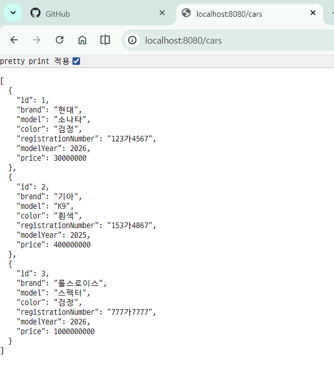
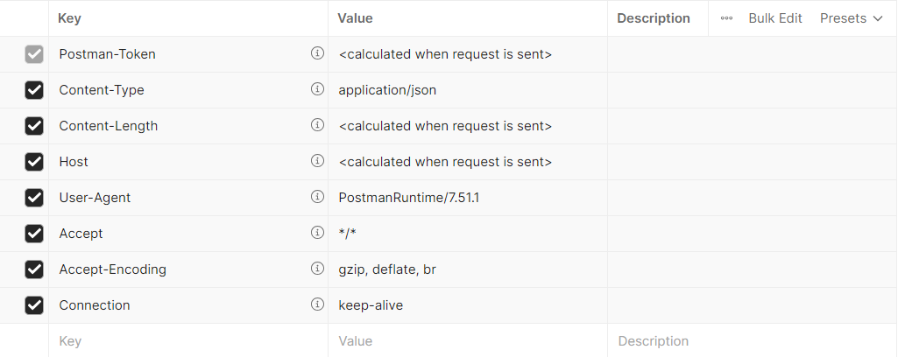
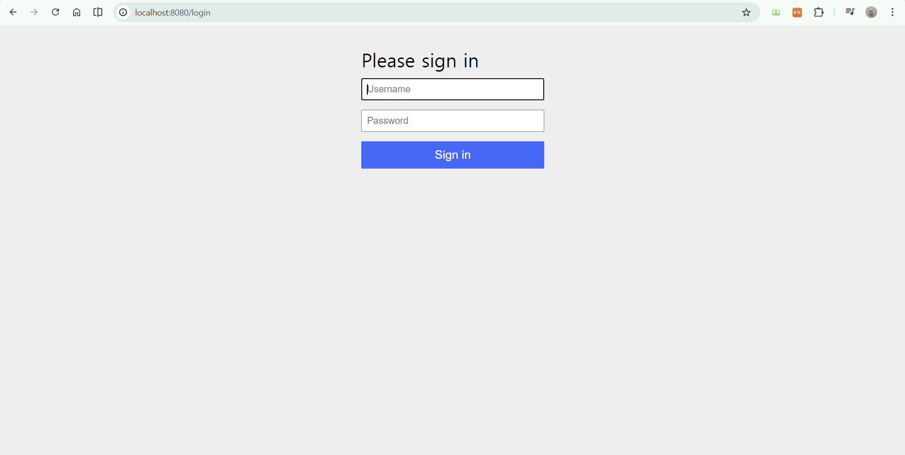

# 오늘의 과제
- cardatabase00 으로 springboot 프로젝트를 생성하시오.
- dependencies injection은 start.spring.io를 사용하셔도 되고,
  추후 mvn을 통해 추가해도 무방
    1. devtools
    2. web
    3. mariadb - testdb
    4. JPA
    5. entity classes - Owner / Car
    6. Lombok은 적용하지 않고,
       기존 cardatabase와 동일한 기능을 하도록 작성
    7. start.spring.io에서 generate 클릭하면 download 폴더에 들어감
       걔를 korit_12_springboot로 이동시켜서 나중에 push할 수 있게끔
       명확하게 세팅할 것.
```java
spring.application.name=cardatabase
spring.datasource.url=jdbc:mariadb://localhost:3310/cardb
spring.datasource.username=root
spring.datasource.password=1234
spring.datasource.driver-class-name=org.mariadb.jdbc.Driver
spring.jpa.generate-ddl=true
spring.jpa.hibernate.ddl-auto=create-drop
spring.jpa.show-sql = true
```
1. MariaDB로 옮기고 나서의 부분입니다. H2 관련 설정을 build.gradle / application.properties에서
   삭제해주셔야 함.
2. URL 부분을 수정
3. 데이터베이스 드라이버 클래스를 정의해야 함.
4. `spring.jpa.generate-ddl` 설정은 JPA가 데이터베이스를 초기화해야하는지 아닌지 (true / false)를 
   정의해야 함.
5. `spring.jpa.ddl-auto` 설정은 데이터베이스 초기화의 작동방식을 정의
    - none : 대부분의 DB에서의 기본값
    - validate
    - update : 새로 켤 때마다 확인해서 차이점이 있는 경우에만 테이블 관련 설정을 업데이트
    - create : 생성만 하고 삭제 안하기에 DB에 값이 한번 들어가면 유지
    - create-drop : h2에서는 기본값이 얘임.
      실행할 때마다 테이블을 생성하고, 종료되면 삭제하는 형태

# cardatabase2를 생성하고, cardatabase에서 실행되는 부분만 남기고 다 날리기
# RESTful 웹 서비스 만들기
웹 서비스란 HTTP 프로토콜을 이용하여 인터넷을 통해 통신하는 애플리케이션을 의미.
웹 서비스 아키텍처에는 다양한 유형들이 있긴하나 아까 저희가 확인한 것 처럼
Restful API가 전반적으로 사용되고 있음.

# 수업 구성
1. 날로 먹는 Spring Data Rest의 사용법
2. 근데 코드를 일일이 작성하려면 어떡하는지

## REST 기초
- Relational State Transfer의 축약어로 웹 서비스를 제작하기 위한 아키텍처 스타일임.
  REST는 특정 언어나 플랫폼에 의존적이지 않으면서 모바일 앱, 기타 서비스와 같은 
  다양한 클라이언트들이 서로 통신할 수 있도록 해야함.
  RESTful 서비스는 늘어나는 수요 및 기능 추가에 대해 확장성이 높음

- 허나, RESTful이 특정한 표준이나 프레임워크는 아니고 로이 필딩이라는 개발자가
  제시한 제약 조건들의 집합에 해당.

1. 상태 비저장 : 서버는 클라이언트 상태에 대한 어떤 정보도 저장하지 않아야 함.
2. 클라이언트 - 서버 간 독립성 : 클라이언트와 서버는 독립적으로 작동해야 함.
                                 그리고 서버는 클라이언트의 요청 없이는 어떠한 정보도 전송해서는 안됨.
3. 캐시 기능 : 여러 클라이언트가 동일한 리소스를 요청하는 경우가 많으므로 성능 향상을 위해 리소스에 캐싱을 적용해야 함.
(캐싱 기능은 react에서도 수업할 예정이지만 미리 정의를 검색하는 것을 추천함)
4. 일관된 인터페이스 : 서로 다른 클라이언트에 의한 요청이더라도 응답은 동일하게 보여야 함. 
클라이언트의 예시로는 브라우저, 자바 애플리케이션, 모바일 애플레케이션 등.
5. 계층형 시스템 : 전체 서비스에 영향을 주지 않고 구성 요소를 추가하거나 수정할 수 있어야 함. 이는 확장성과 관련
6. 주문형 코드 : 선택적인 제약 조건에 해당. 대부분의 서버는 정적 컨텐츠를 JSON 또는 XML 형식으로 전송하는데,
                 필요한 경우 컨텐츠 자체가 아니라 실행 코드도 전송할 수 있어야 함.

특히 일관된 인터페이스는 중요한 제약 조건에 해당하기에 REST 아키텍처에 이하의 요소가 들어갈 것을 요구
1. 리소스 식별 : 리소스는 고유 식별자 (예 : 웹 기반 REST 서비스의 URI)로 식별해야 함 (엔드 포인트 개념으로 설명)
                 REST 리소스는 이해하기 쉬운 디렉터리 구조의 URI를 노출해야 함. 즉, 이름을 잘 지어야 함.
2. 표준을 통한 리소스 조작 : 리소스를 요청할 때 서버는 리소스의 표현으로 응답해야 함. 일반적인 표현 형식으로는 JSON / XML이 있음
3. 자체 설명적인 메시지 : 메시지는 서버가 처리 방법을 알 수 있는 충분한 정보가 포함되어야 함.
4. HATEOAS : Hypermedia As The Engine Of Application State의 약자로 응답에는 서비스의 다른 영역을 연결되는 링크가 포함되어야 함.
-> JSON 내부에 다른 링크가 URI가 있어 서로 연결연결 된다는 것을 의미.

# RESTful 웹 서비스 만들기
- SpringBoot 상에서 모든 HTTP 요청은 controller 클래스로 처리됨.
- domain 패키지와 동일한 수준에 controller 패키지를 생성
- controller 패키지 내부에 CarController 클래스를 생성
```java
package com.korit12.cardatabase.controller;

import org.springframework.web.bind.annotation.RestController;

@RestController
public class CarController {
  @GetMapping("/cars")
  public List<Car> getCars() {
    // 자동차를 검색하고 return하는 로직
  }
}
```
`@GetMapping("/cars")` : 는 localhost:8080/cars url로 들어갔을 경우 
getCars()라는 메서드가 호출될 수 있도록 경로를 설정한 것이라고 볼 수 있음.
특히 이상의 코드에서 모든 자동차 객체가 LIST 형태로 return 되는 것을 알 수 있는데, 
`RestController`와 `@GetMapping`으로 인해 Java List로 리턴된 것이 자동으로 JSON 객체로 변환
이상의 코드는 GET 요청만 처리할 수 있도록 되어 있음. 그렇다면 
`@PostMapping`, `@DeletMapping`, `@PutMapping` 등도 있음.

- 그렇다면 저희는 Car 객체들을 가지고 와야 한다는건데, 어디서 가지고 옴?
-> DB에서 -> SpringBoot에서 DB에 접근하는 애는 누구다? -> Repository

- 그래서 이하의 코드를 확인했을 때, CarRepository를 자료형으로 하는 filed인
  carRepository를 정의했고, 걔의 .findAll() 메서드를 호출
```java
package com.korit12.cardatabase.controller;

import com.korit12.cardatabase.domain.Car;
import com.korit12.cardatabase.domain.CarRepository;
import org.springframework.web.bind.annotation.GetMapping;
import org.springframework.web.bind.annotation.RestController;

import java.util.List;

@RestController
public class CarController {
    private final CarRepository carRepository;

    public CarController(CarRepository carRepository) {
        this.carRepository = carRepository;
    }

    @GetMapping("/cars")
    public List<Car> getCars() {
        return carRepository.findAll();
    }
}
```

## Sring Data Rest 사용하기
- Spring Data REST는 스프링 데이터 프로젝트의 일부이며, 
  스프링으로 RESTful 웹 서비스를 빠르게 구현해주는 방식입니다.
  그리고 HATEOAS도 지원.



근데 브라우저에서 해당 uri로 들어갔을 때 GET 요청이 이루어진건데,
컨디션 안좋으면 whiteable이 뜸

그래서 저희는 이부분의 안정성을 위해 외부 프로그램 도입
chrome에서 postman 검색 설치 -> GET 요청으로 localhost:8080/api/cars를
날렸을 때 자동차 목록이 JSON 형태로 나오면 성공

여기서 Spring Data REST 장점은 이하와 같음
1. CarController를 날렸는데 getCars() 메서드를 요청한 것과 동일한 결과값이 나왔다는 점.
2. 저희는 getCars()만 있고, getCar(int id)가 없죠. 하지만 
자동차 하나를 return하는 메서드가 알아서 정의되어 있다는 점
3. Owner쪽은 손도 안댔는데 getOwners와 getOwner가 다 존재한다는 점.
즉, Controller에 해당하는 클래스 부분을 전부 다 의존성으로 처리했다는 점에서 강점이 있음.

하지만 이는 default의 정보만 가지고 올 수 있기에 커스텀이 불가능하다는 측면에서 엄청 널리 쓰이지는 않음.

### CRUD를 일단 postman에서 실행해보기
스프링 데이터 REST는 모든 CRUD 작업을 제공합니다.
HTTP 메서드 | CRUD
-----------|-------
get|읽기
psot|생성
put/patch|업데이트
delete|삭제

1. 삭제 : delete 요청을 날려야하는데, 전부 다 삭제하고 싶은게 아니라면
특정 차를 삭제해야함. 그렇다면 특정 차라는 것을 확인할 수 있는 방법은 무엇일까?
  - localhost:8080/api/cars/1 uri로 delete 요청
  - 특정 ID 값을 가진 애를 기준으로 삭제하기에 (전체 삭제가 아니라면)
    call3() 유형의 메서드를 가지게 됨. 매개변수 있음. return 없음.

2. 생성 : POST 요청 해야함. 잘 생각해보셔야 할점은 POST 요청을 한 시점에는 DB에 차가 있을까요 없을까요가 문제.
우리는 DB에서 ID값을 가져오기에 POST 요청을 하는 시점에는 당연히 고유값 역할을 하는 ID가 없을 것. 그러면 생성 이후에 ID가 할당이 된다고 생각할 수가 있겠음.


3. 수정 : Put / Patch로 나뉨. put을 사용하는 경우에는 전체 key-value를 
다 입력해야하고, patch를 사용하는 경우에는 수정할 부분의 key-value만 입력하면 됨.

```json
{
  "color": "검정"
}
```
- 근데 Tesla 차 만든 것은 좋은데 owner 부분이 null로 입력되어있습니다. 방금 생성한 차에 Owner를 추가해보도록 하겠습니다. Put method 적용해보겠습니다.

    - url : http://localhost:8080/api/vehicles/4/owner
    - text : Content-Type : text/uri-list
    - content : http://localhost:8080/api/owners/여러분아이디

- 그리고 PUT 요청 json 버전을 이하의 이미지로 포함시켰습니다.


- 그런데 DB 상에서의 ID 값을 사용자들은 알 수가 없습니다. 자기 차량 정보를 수정하기 위해서는 기본적으로 id 값이 있어야 할 것 같은데 사용자들이 알지 못한다면 문제가 있을 수 있겠네요.

- Brand 명 등을 통해서 검색을 해서 특정 자동차 정보를 가지고 올 수 있어야겠네요.

그리고 postman에서 GET http://localhost:8080/api/vehicles 를 검색했을 때, 맨 마지막에 `http://localhost:8080/api/vehicles/search`가 추가된 것을 확인할 수 있습니다.

즉 인터페이스에 커스텀 추상 메서드를 추가했고, 이것을 postman이나 백엔드 api에서 적용하기 위한 방법을 학습한 것이라고 할 수 있겠습니다.

### 과정
1. Repository 클래스에 `@RepositoryRestResource`를 추가합니다. - 저희는 아까 endpoint 경로 바꿀 때 썼습니다.
2. 쿼리 매개변수에 `@Param`을 추가했습니다. 이하를 확인하세요.
```java
package com.korit12.cardatabase.domain;

import org.springframework.data.jpa.repository.JpaRepository;
import org.springframework.data.repository.query.Param;
import org.springframework.data.rest.core.annotation.RepositoryRestResource;

import java.util.List;

@RepositoryRestResource(path = "vehicles")
public interface CarRepository extends JpaRepository<Car, Long> {
    // 브랜드로 자동차 검색
    List<Car> findByBrand(@Param("brand") String brand);
    // 색상으로 자동차 검색
    List<Car> findByColor(@Param("color") String color);
}
```

- 그런데 저희는 하나하나 만들고 있으니까 그렇다고 치는데 항상 협업이 전제된다고 했습니다. 우리반 사람들은 어떤 uri가 있는지 이해하겠지만 다른반 분들은 모르겠네요. 특정 api가 어떤 기능을 한다는 것을 명시하는 것이 api 명세서라는 개념입니다.