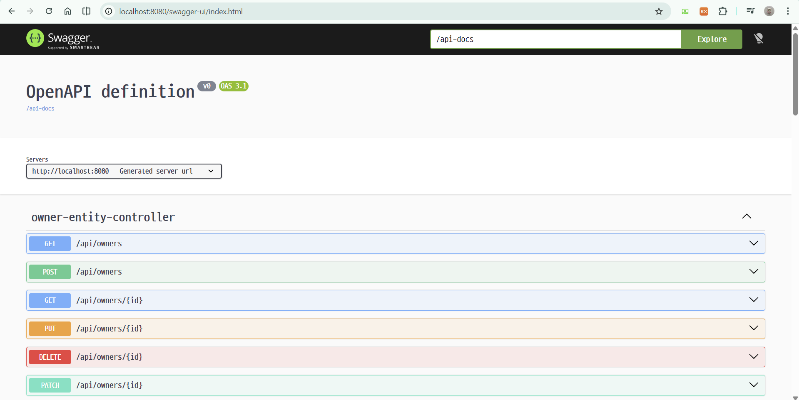

# 입실 체크해주세요 !

# RESTful API 명세서 작성
- RESTful API는 이용하는 개발자가 그 기능과 작동을 이해할 수 있도록
  적절히 문서화가 되어야 합니다. (어제 notion 예시 보여드림)
  그리고 그 문서에는 이용할 수 있는 엔드포인트, 허용되는 데이터 형식,
  API와 상호작용하는 방법 등이 포함되어야 함.

- 현재 저희는 Spring Data REST를 적용한 상태임. 
  즉, 엔드포인트들이 자동생성되기에 우리가 파악하지 못한
  부분들이 있을 수 있어 API 명세서는 더 중요하다고 할 수 있음.

# SpringBoot의 Swagger / Open API
1. Swagger / Open API란?
  - Open API Specification(OAS) : RESTful API를 설계,
    구축, 문서화하는 방법을 정의하는 표준 사양
  - Swagger : 이상의 표준 사양을 구현하여 개발자가 API 구조를
    시각적으로 확인하고 직접 테스트할 수 있도록 돕는 툴.
  - 도입 목적 : 백 - 프론트 간 협업 시 별도의 문서 작성 없이 실시간으로
    업데이트되는 API 명세서를 제공하기 위함.

# API 란?
## 정의
- Application Programming Interface의 축약어로 
  _서로 다른 소프트웨어가 대화할 수 있게 해주는 규칙이나 매개체_
- 손님(클라이언트) : 주문을 하는 사람 (앱이나 웹사이트)
- 주방(서버) : 요리를 하는 곳 (데이터나 기능을 가진 시스템)
- 점원(API) : 손님이 주문을 주방에 전달하고, 주방에서 만든 음식을
  다시 손님에게 가져다 주는 역할

- 이상에서의 중요한 점은 손님은 주방 안에서 어떤 일이 일어나는지 (내부로직)
  알 필요가 없다는 것입니다. 점원에게 정해진 규칙 (메뉴)대로 말하기만 하면
  원하는 결과를 얻을 수 있다는 점이 핵심.

## API의 핵심 역할
1. 전달자 : 요청(request)을 받고 응답 (response) - req / resp 로 작성하는 경우도 있음.
2. 보안/관문 : 아무나 데이터를 가져가지 못하게 인증된 사용자만 접근을 허용함.
    (API key를 활용)
3. 표준화 : 서로 다른 언어(자바 / 파이썬 등)로 만들어진 프로그램들이 같은 규칙으로 소통하게끔 함.

- 우리가 만든 백엔드의 controller 클래스가 API 입구가 됨.
  즉, Controller 클래스는 프론트엔드에서 요청이 왔을 때 맨 처음
  백엔드 상으로 처리하는 관문 역할을 하는 곳.

# 프로젝트 설정
1. SpringBoot 3.xx 버전에서는 `jakarta`로 써야 함.
    혹시 옛날 버전 들고 오면 `javax`로 작성하는 경우가 있음.
```java
implementation 'org.springdoc:springdoc-openapi-starter-webmvc-ui:2.8.15'
```
- starter가 포함된 버전을 사용해야 오류 X
- mvn을 통할 경우 openapi를 검색하면 너무 많이 나오는데
  starter / webmvc 존재 유무로 체크

2. application.properties 수정
- Swagger UI의 경로와 API 문서의 기본 정보를 설정함.
  현재 저희는 Spring Data REST 때문에 basePath가 `/api`로 되어있다는 점을
  꼭 고려해야 함.
```java
# Swagger UI access path config(default : /swagger-ui/index.html)
springdoc.swagger-ui.path=/swagger-ui.html

# Open API doc path
springdoc.api-docs.path=/api-docs

# Configuration related to the Spring Data REST
springdoc.show-data-rest=true
```

예를 들어, 이상까지만 작성했더라도 http://localhost:8080/swagger-ui/index.html 로 접속했을 경우에

이렇게 뜸.

3. API 문서 상세 설정
```java
package com.korit12.cardatabase.config;

import io.swagger.v3.oas.models.OpenAPI;
import io.swagger.v3.oas.models.info.Info;
import org.springframework.context.annotation.Bean;
import org.springframework.context.annotation.Configuration;

@Configuration
public class OpenApiConfig {
    @Bean
    public OpenAPI cardatabaseOpenAPI() {
        return new OpenAPI()
                .info(new Info()
                        .title("Car Database API")
                        .description("자동차 및 소유자 관리를 위한 REST API 명세서")
                        .version("1.0.0")
                );
    }
}
```
- `@Bean` : 메서드 레벨의 애너테이션으로, Spring 컨테이너에 의해 관리되는 객체인 빈을 정의하고 등록하는 역할을 함.
1. `@Bean`의 정의
  - 객체 등록 : 해당 메서드가 반환하는 객체를 Spring의 IOC(Inversion of Control) 컨테이너가 관리하는 빈으로 등록하도록 지시.
  - 설정 소스 : 보통 `@Configuration` 애너테이션이 붙은 클래스 내에서 사용되며,
    이 클래스는 빈 정의를 제공하는 소스 역할을 함.
  - 수동 등록 : 개발자가 직접 제어할 수 없는 외부 라이브러리 객체를 생성하거나,
    복잡한 초기화 로직이 필요한 객체를 Spring 빈으로 등록

- 상세 동작 관련 추가 설명
    1. 설정 소스 인식 : SpringBoot 애플리케이션이 실행될 때  `@Configuration`이 붙은 클래스를 스캔하여 빈 정의 소스로 인식.
    2. 메서드 실행 및 등록 : 클래스 내부에서 `@Bean`이 붙은 cardatabaseAPI() 메서드를 Spring이 직접 호출
    3. 빈 관리 : 이상의 메서드에서 return된 openAPI 객체는 Spring 컨테이너 내에서 보관,
        해당 객체는 나중에 swagger UI가 API 명세서를  생성할 때, 제목 / 설명 / 버전 등의 정보를 제공하는 설정 데이터로 사용됨.
    4. 유지보수성 향상 : 이처럼  `@Bean`을 통해 설정 정보를 분리, 관리하면 애플리케이션의 핵심 로직과 외부 설정 라이브러리 간의
        결합도를 낮추고 유연하게 변경이 가능

# 1번 질문에 대비한 Bean 정리
Spring 프레임워크 상에서 빈은 **스프링의 IoC(제어의 역전) 컨테이너가 생성하고 관리하는 자바 객체** 를 의미함.

단순히 우리가 `New` 키워드를 이용하여 직접 생성하는 일반적인 Java 객체와는 달리 빈은 스프링 컨테이너에 의해 생명주기 (생성, 초기화, 소멸)가 관리되는 것이 특징.

1. 빈의 핵심 역할 : 의존성 주입
  - 빈은 `ApplicationContext`라는 컨테이너를 통해 빈을 관리하며, 객체 간의 의존성을 자동으로 연결해줌
  - 이상을 통해 코드 간의 결합도를 낮추고 유연성을 높일 수 있음.
  - 예시 : CarDatabaseApplication 클래스에서 직접 CarRepository 객체를 생성하지 않고
    field 선언을 통해서 스프링이 관리하는 빈을 주입 받아 사용함.
  
      - 이상의 경우에 CarRepository carRepository = new CarRepository(); 를
        저희가 호출한 적이 없다는 점에서 Spring 컨테이너에서 알아서 객체 생성해서
        field 주입 했다고 해석할 수 있음.

2. 빈 등록 방법
  - `@Bean`은 빈을 수동으로 등록하는 방법 중 하나고, 위의 예시를 생각했을 때는
  - 컴포넌트 스캔을 통해서 더 자주 이루어짐. 
    컴포넌트 스캔이란, 특정 애네테이션이 붙은 클래스를 자동으로 검색하여 빈으로 등록하는 것을 의미함.
  - CarRepository에 애너테이션이 없는데요 라는 답변이 나올 수 도 있음.
    - @Component : 일반적인 컴포넌트 빈
    - @Service : 비지니스 로직을 처리하는 서비스 클래스
    - @Repository : 데이터베이스 접근을 담당하는 리포지토리 클래스
    - @Controller / @RestController : 웹 요청을 처리하는 컨트롤러 클래스
  - 설정 클래스에서 수동 등록 : @Configuration 내부에서 @Bean이 있으면 수동 등록이 됨

3. 빈의 특징
    1. 관리 주체 : 개발자가 아니라 스프링 컨테이너가 객체를 관리
    2. 싱글톤 원칙 : 기본적으로 스프링은 빈을 단 하나만 생성하여 애플리케이션 전체에서 공유하여 재사용할 수 있도록 함.
    3. 명명 규칙 : 빈은 고유한 이름을 가지며, 스프링은 이 이름을 통해 필요한 곳에 적절한 빈을 찾아 주입.

# 백엔드 보호
cardatabase3 만들고, 주석들 좀 지우겠음.

1. Spring Security의 이해
2. JWT(JSON Web Token)으로 백엔드 보호
3. 역할 기반 보안 (Role-based Security)

## 스프링 시큐리티
- Java 기반 웹 애플리케이션을 위한 보안 서비스 제공 라이브러리
- default 설정 값
1. 인메모리 사용자 하나를 포함하는 `AuthenticationManager` 빈.
    username은 user, 암호는 console창에 출력됨
    (마치 h2를 사용했을 때 uri 경로가 임시적으로 발급됐던 것과 동일)
2. `/css`, `/images`와 같은 일반적인 정적 리소스 위치의 경로를 무시.
    다른 모든 엔드 포인트에 대한 HTTP에 인증을 요구함.
3. 스프링 자체에서의 `ApplicationEventPublisher` 인터페이스로 보호되는 보호 이벤트
4. HSTS, XSS, CSRF 등 일반적인 저수준 기능을 기본적으로 활성화.
5. 자동 생성 로그인 페이지

- 의존성 추가할 것.


- http://localhost:8080 으로 접속했을 때, 혹은 /api까지 해서
  접속했을 때 알아서 /login 엔드포인트로 넘어가면서 로그인을 요구

- 이는 buil.gradle에 spring security를 추가했기에 생겨난 것.

- 그런데 재실행해보면 비밀번호가 바뀌어있고 또 찾아서 로그인해야하고
  그런 상황이 벌어짐. username / password를 고정시키고 싶다면
  스프링 시큐리티에 대한 Config 클래스를 정의해야만 함.
  해당 클래스 내에서 특정 역할이나 사용자가 접근할 수 있는
  URL 또는 URL 패턴을 정의할 수 있음.
  또한 인증 매커니즘, 로그인 프로세스, 세션 관리 등도 정의 가능

- config 패키지 내에 SecurityConfig 클래스를 정의하시오.
```java
package com.korit12.cardatabase.config;

import org.springframework.context.annotation.Bean;
import org.springframework.context.annotation.Configuration;
import org.springframework.security.config.annotation.web.configuration.EnableWebSecurity;
import org.springframework.security.core.userdetails.User;
import org.springframework.security.core.userdetails.UserDetails;
import org.springframework.security.crypto.bcrypt.BCryptPasswordEncoder;
import org.springframework.security.crypto.password.PasswordEncoder;
import org.springframework.security.provisioning.InMemoryUserDetailsManager;

@Configuration
@EnableWebSecurity
public class SecurityConfig {
    @Bean
    public InMemoryUserDetailsManager userDetailsService() {
        UserDetails user = User.builder()
                .username("user")
                .password(passwordEncoder().encode("password"))
                .roles("USER")
                .build();
        return  new InMemoryUserDetailsManager(user);
    }

    @Bean
    public PasswordEncoder passwordEncoder() {
        return new BCryptPasswordEncoder();
    }
}
```

- 이상의 코드에서 `@Configuration`, `@EnableWebSecurity` 애너테이션은 defualt 웹 보호 구성을 해제하고,
  개발자가 직접 Config 관련 설정을 정의할 수 있도록 허용함.
  이후 수업에서 `filterChain(HttpSecurity http)` 메서드 내에서 애플리케이션의 어떤 엔드포인트가 보호되고 있는지,
  어떤 엔드포인트가 보호되고 있지 않은지 정의할 수 있음.

- UserDetailsService를 구현하는 스프링 시큐리티의 InMemoryUserDetailsService를 이용하여
  애플리케이션에 인메모리 user를 추가함. (사실 테스트 용으로만 적합.)
  메모리에 저장된 user / password 인증을 구현함.
  Builder patton을 이용함.

- H2에서 확인하셨듯이 인메모리 사용자는 DB에 저장된 것이 아니기에 껏다 켜면 초기화가 이루어짐.
  User 관련 속성을 DB에 저장하고 싶다면 Car / Owner와 마찬가지로 엔티티 클래스와 리포지토리 클래스를 정의해야만 함.
  그리고 암호는 일반 텍스트 형식으로 DB에 저장하면 보안 문제가 생김.

- AppUser 엔티티 클래스와 리포지토리 클래스를 생성하시오.

- findByUsername 메서드를 정의하시오. -> 어디에 어떻게 적을지 떠올라야 한다는 점.
```java
package com.korit12.cardatabase.domain;

import org.springframework.data.jpa.repository.JpaRepository;

import java.util.Optional;

public interface AppUserRepository extends JpaRepository<AppUser, Long> {
    Optional<AppUser> findByUsername(String username);
}
```
- 이상에서 주목해야 할 것은 여태까지 CarRepository에 추상 메서드들을 정의했을 때는 결과값들이
  기본적으로 복수로 나오기에 List 자료형을 썻음. 허나 findByUsername() 메서드의 경우에는 Appuser의
  field인 username이 기본적으로 `@Colum(nullable = false, unique = true)`라는 설정때문에 
  결곽밧은 하나거나, 아니면 0개입니다. 그렇다면 return type을 list로 설정하는 것은 적절하지 않은 선택지가
  될 것. 그래서 옛날에는 NullPointException이 발생하는 문제가 생겼을 것. 이를 해결하기 위해서는 

```java
public AppUser findByUsername(String username) {
  if(username이 DB 내에서 일치하는 username이 있다면) {
    return 일치하는 객체 전체를 return (AppUser 자료형이니까)
  }
  return null;
}
```
과 같은 방식으로 미리 예외처리를 해줘야만 했음. 그런데 AppUserRepository는
인터페이스니까 일반 메서드를 만들 수 없음. 즉, findByUsername()이 필요할 떄마다
이상의 로직이 항상 필요하다는 문제점이 있음. 
이를 해결하기 위한 자료형이 `Optional`에 해당

- 이건 처음 배우는 자료형에 해당. Optional 내부에는 null이 존재할 수 있는데, 
  그 상황에서도 예외가 발생하지 않음. 다만 Optional 내부에 AppUser 자료형이
  존재한다면, AppUser 객체를 꺼내는 별개의 메서드를 호출할 필요는 있음.

- domain과 동일한 수준에 service 패키지를 생성하겠음 
-> 내부에 UserDetailsServiceImpl 이라는 클래스를 생성합니다.

```java
package com.korit12.cardatabase.service;

import com.korit12.cardatabase.domain.AppUser;
import com.korit12.cardatabase.domain.AppUserRepository;
import lombok.AllArgsConstructor;
import org.springframework.security.core.userdetails.User;
import org.springframework.security.core.userdetails.User.UserBuilder;
import org.springframework.security.core.userdetails.UserDetails;
import org.springframework.security.core.userdetails.UserDetailsService;
import org.springframework.security.core.userdetails.UsernameNotFoundException;
import org.springframework.stereotype.Service;

import java.util.Optional;

@Service
@AllArgsConstructor
public class UserDetailsServiceImpl implements UserDetailsService {
    // field 선언
    private AppUserRepository appUserRepository;

    @Override
    public UserDetails loadUserByUsername(String username) throws UsernameNotFoundException {
        Optional<AppUser> user = appUserRepository.findByUsername(username);
        UserBuilder builder = null;
        if(user.isPresent()) {      // 이하의 실행문이 실행된다면 user에 AppUser 객체가 있다는 의미
            AppUser currentUser = user.get();       // Optional에서 제네릭으로 존재하는 객체를 빼내는 메서드
            builder = User.withUsername(username)
                    .password(currentUser.getPassword())
                    .roles(currentUser.getRole());
        } else {
            throw new UsernameNotFoundException("해당 username을 가진 사용자를 찾지 못함.");
        }
        return builder.build();
    }
}
```

- 이상의 코드에서 집중해서 봐야할 점은 일단 클래스명임.
  UserDetailsServiceImpl 이라는 이름을 지니고 있는데,
  이는 대표적인 인터페이스를 구현한 클래스를 나타내는
  클래스 명명법으로 `인터페이스명 + Impl` 을 기준으로 작성
  즉, UserDtailsService라는 인터페이스의 추상 메서드를 
  구현한 클래스라서 UserDetailsServiceImpl이 되는 것임.
  그래서 더럽게 읽기 힘드네가 아니라 최초 명명법 발생 당시에는
  가독성을 높이기 위한 클래스 이름 짓기 방식이었다고 봐야 함.

- loadUserByUsername() 메서드 내부에서 AppUser 클래스의 인스턴스인
  user를 그대로 쓰는 것이 아니라
  userBuilder라고 이상한 거 가지고 와서 선언하고, 거기 내부에 Appuser의
  field의 값들을 하나씩 대입한 다음에 return했다는 점임.
  이는 인터페이스의 정의를 명확하게 알지 못하면 효율적이지 못한
  코드로 해석할 여지가 있음.
  인터페이스는 추상 메서드만 존재함. 
  그리고 이를 구현하는 클래스는 인터페이스 내에 있는 추상 메서드들을 강제로
  구현해야만 함. 우리가 AppUser라고 하는 엔티티 클래스를
  만들기 이전에 인터페이스가 존재했고, 이를 구현했으므로 
  당연히 추상 메서드들의 return type은 AppUser가 될 수 없음.
  또한 다른 개발자들도 이 인터페이스를 그대로 갖다 쓸것이기에 
  자료형에 대한 보편적인 폼이 존재해야만 함.
  그렇게 추상 메서드인 loadUserByUsername()의 return 타입이
  고정되어 있으므로 우리는 우리가 만든 entity class의 객체를 UserDetails 클래스의
  객체 형태로 대입해주는 과정을 거쳐야만 함.
  그래서 if 문 내부의 실행문에서 대입 로직이 존재하게 됨.
  else는 당연히 일치하는 AppUser가 없다는 뜻이므로 예외처리를 하게 됨.

- 이후는 스프링 시큐리티가 인메모리 사용자 대신에 방금 만든 AppUser 관련
  데이터베이스의 사용자를 참조하게끔 코드를 수정할 예정임.

```java
package com.korit12.cardatabase.config;

import org.springframework.context.annotation.Bean;
import org.springframework.context.annotation.Configuration;
import org.springframework.security.config.annotation.web.configuration.EnableWebSecurity;
import org.springframework.security.core.userdetails.User;
import org.springframework.security.core.userdetails.UserDetails;
import org.springframework.security.crypto.bcrypt.BCryptPasswordEncoder;
import org.springframework.security.crypto.password.PasswordEncoder;
import org.springframework.security.provisioning.InMemoryUserDetailsManager;

@Configuration
@EnableWebSecurity
public class SecurityConfig {
    @Bean
    public InMemoryUserDetailsManager userDetailsService() {
        UserDetails user = User.builder()
                .username("user")
                .password(passwordEncoder().encode("password"))
                .roles("USER")
                .build();
        return  new InMemoryUserDetailsManager(user);
    }

    @Bean
    public PasswordEncoder passwordEncoder() {
        return new BCryptPasswordEncoder();
    }
}

```
bcrypt는 닐스 프로보스 / 데이비드 마지에르가 설계한 해싱함수로, 예를 들어 `$2a$12$To9/Z9IJTWrwlD8Xs1.v8e5Ps4AZR9VSaac7fMP7.gHc98dvUmV6.` 는 admin 문자열에서 생성되는 bycript의 예시입니다.

`$2a`는 알고리즘 버전을 의미하고, `$12`는 알고리즘 강도를 나타냅니다. 그리고 Spring Security 상에서의 BcryptPAsswordEncoder의 기본 강도는 10으로 되어있습니다.

근데 http://localhost:8080/api/appUsers로 들어가게 되면

```json
{
    "_embedded": {
        "appUsers": [
            {
                "username": "user",
                "password": "$2a$12$vpm4SL5Lr7mgh0tFWPi/D.UQ.hELym/odoIe0tisoD425LCSo5dTm",
                "role": "User",
                "id": 1,
                "_links": {
                    "self": {
                        "href": "http://localhost:8080/api/appUsers/1"
                    },
                    "appUser": {
                        "href": "http://localhost:8080/api/appUsers/1"
                    }
                }
            },
            {
                "username": "admin",
                "password": "$2a$12$bLkCf2TlBStKdCUtnsCPr.04L4dCryQBLgNOCiwTlkfh.G6qltweu",
                "role": "Admin",
                "id": 2,
                "_links": {
                    "self": {
                        "href": "http://localhost:8080/api/appUsers/2"
                    },
                    "appUser": {
                        "href": "http://localhost:8080/api/appUsers/2"
                    }
                }
            }
        ]
    },
    "_links": {
        "self": {
            "href": "http://localhost:8080/api/appUsers?page=0&size=20"
        },
        "profile": {
            "href": "http://localhost:8080/api/profile/appUsers"
        },
        "search": {
            "href": "http://localhost:8080/api/appUsers/search"
        }
    },
    "page": {
        "size": 20,
        "totalElements": 2,
        "totalPages": 1,
        "number": 0
    }
}
```
라는 결과값을 얻게 됨. 그러니까 자기가 로그인만 되어 있으면 다른 사람들 비밀번호 해싱 함수 버전을 얻을 수 있다는 것임.

그래서 AppUserRepository를 통해 요청을 날리지 못하도록
설정하겠음. 그리고 이는 Spring Data Rest 때문에 자동으로 AppUser 관련 엔드 포인트가 생성되기에 ....